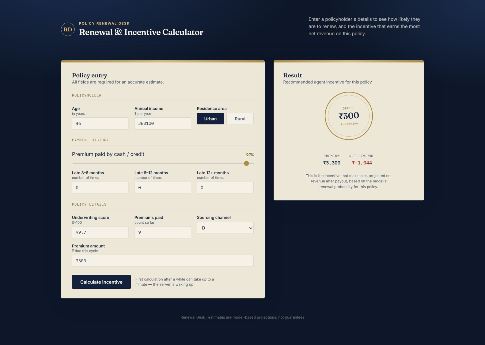

# 💰 Insurance Incentive Prediction


---

## 🔗 Live Links

* 🌐 **Website:** [[https://insurance-incentive-prediction.vercel.app/](https://insurance-incentive-prediction.vercel.app/)]
* ⚙️ **API (FastAPI, deployed):** [[https://insurance-incentive-prediction.onrender.com/predict](https://insurance-incentive-prediction.onrender.com/predict)]

---

## 📌 Overview

This project is an **end-to-end machine learning pipeline** that predicts insurance policy **renewal probability** and recommends the **optimal agent incentive** required to maximize expected revenue. It covers the complete lifecycle — from data preprocessing and model training to serving live predictions through a **FastAPI backend**, which is connected to a fully deployed **website frontend**.

---

## 🏗️ Architecture

```text
User (Website) → FastAPI Backend (Render) → ML Pipeline (Imputer + Model) → Incentive Optimization → JSON Response → Website
```

---

## 🔄 End-to-End Workflow

### 🔹 1. Data Preprocessing

* Cleaned and prepared raw policyholder data
* Handled missing values using a dedicated **imputer** (`Parth_Imputer.pkl`)
* Engineered a combined feature: `Total_late` (sum of late payment counts across 3–6, 6–12, and 12+ month buckets)

---

### 🔹 2. Model Training

* Trained a renewal-probability classification pipeline (`renewal_pipeline.pkl`) using features such as:

  * Percentage of premium paid by cash/credit
  * Policyholder age and income
  * Late payment history
  * Underwriting score
  * Number of premiums paid
  * Sourcing channel and residence area type
* Model outputs the **probability of policy renewal**

---

### 🔹 3. Incentive Optimization Logic

For every policy, the model searches across a range of agent incentives (₹500 – ₹4500) to find the incentive that **maximizes net expected revenue**:

```text
agent_effort(I)     = 10 * (1 - e^(-I / 400))
agent_proba(effort) = 0.20 * (1 - e^(-effort / 5))
revenue             = premium * (base_probability + agent_probability) - incentive
```

The incentive that yields the highest revenue over the no-incentive baseline is selected and returned for each policy.

---

### 🔹 4. Backend (FastAPI)

* Exposes a single `/predict` endpoint accepting a batch of policy records
* Loads the imputer and trained model on request
* Returns, for each policy: **premium, optimal revenue, and recommended incentive**
* CORS-enabled so the deployed website can call the API directly from the browser

```python
@app.post("/predict")
def run_insurance(request: RevenueRenewal):
    ...
    return {"Result": max_rev}
```

---

### 🔹 5. Frontend (Website)

* Simple HTML/CSS/JS interface for entering policyholder details
* Sends data to the FastAPI backend and displays the predicted revenue and recommended incentive
* Deployed and connected end-to-end with the live API

📸 **Website Preview**



🔗 **Live Website:** [[https://insurance-incentive-prediction.vercel.app/](https://insurance-incentive-prediction.vercel.app/)]
🔗 **Live API:** [[https://insurance-incentive-prediction.onrender.com/predict](https://insurance-incentive-prediction.onrender.com/predict)]

---

## 🚀 Tech Stack

* **Language:** Python
* **ML Libraries:** scikit-learn, pandas, numpy, joblib
* **Backend:** FastAPI, Uvicorn, Pydantic
* **Frontend:** HTML, CSS, JavaScript
* **Deployment:** Render (API), Vercel (Website)

---

## 📁 Project Structure

```
Insurance_incentive_prediction/
│
├── README.md
├── LICENSE
├── requirements.txt
│
├── app.py                  # FastAPI backend with /predict endpoint
├── fetch_app.py             # Script for calling/testing the API
│
├── Parth_Imputer.pkl        # Trained imputer for missing values
├── renewal_pipeline.pkl      # Trained renewal probability model
│
├── index.html                # Website frontend
├── style.css
├── script.js
│
└── images/
    └── website_preview.png
```

---

## ⚙️ Getting Started

### 1. Clone the repository

```bash
git clone https://github.com/Rider-04/Insurance_incentive_prediction.git
cd Insurance_incentive_prediction
```

### 2. Install dependencies

```bash
pip install -r requirements.txt
```

### 3. Run the API locally

```bash
uvicorn app:app --reload
```

### 4. Open the website

Open `index.html` in your browser (make sure the API URL in `script.js` points to your running backend).

---

## 📡 API Usage

**Endpoint:** `POST /predict`

**Request Body:**

```json
{
  "data": [
    [0.5, 12000, 500000, 1, 0, 0, 0.85, 10, "A", "Urban", 15000]
  ]
}
```

**Response:**

```json
{
  "Result": [
    {
      "premium": 15000,
      "revenue": 6200.5,
      "incentive": 1500
    }
  ]
}
```

---

## 📈 Key Insights

* Not every policy benefits from an agent incentive — the model identifies exactly which ones do
* Revenue-maximizing incentives vary significantly based on premium size and renewal risk
* A simple diminishing-returns effort/probability model captures realistic agent behavior

---

## 💡 Key Learnings

* Building a production-style ML inference pipeline with FastAPI
* Handling CORS and cross-origin requests between a deployed frontend and backend
* Formulating a business optimization problem (incentive vs. revenue) on top of an ML model
* Deploying and connecting a full-stack ML application end-to-end

---

## 🚀 Future Improvements

* Add a batch upload option (CSV) on the website
* Cache loaded models instead of reloading on every request
* Add authentication and rate limiting to the API
* Visualize incentive recommendations with charts on the frontend

---

## 👤 Author

**Parth Sharma**

---

## ⭐ If you found this project useful, consider giving it a star!